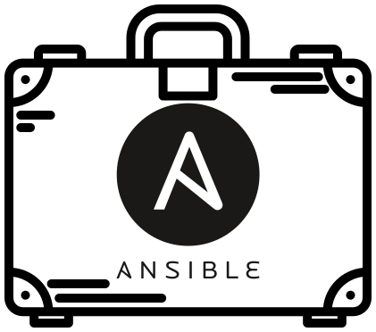

# Ansible suitcase

Install Ansible and its dependency stack into a temporary directory.
No need to change anything in your `~/.whateverrc`, nor to install
anything as root.

## Usage

From your `foosible` wrapper script, do something like this:

```
platform_check () {
    if ! test -f ansible-tmp/.versions 2>/dev/null; then
        curl https://raw.githubusercontent.com/epfl-si/ansible.suitcase/master/install.sh | \
            SUITCASE_DIR=$PWD/ansible-tmp SUITCASE_ANSIBLE_REQUIREMENTS=requirements.yml sh -x
    fi
    export PATH="$PWD/ansible-tmp/bin:$PATH"
    export ANSIBLE_ROLES_PATH="$PWD/ansible-tmp/roles"
}
```

where

- `$PWD/ansible-tmp` is the directory that `ansible.suitcase` will install into. (You can pick any path you like, even outside your “ops” Git depot if you like.)
- `SUITCASE_DIR` and `SUITCASE_ANSIBLE_REQUIREMENTS` are parameters to the `install.sh` script. See the source code of [`install.sh`](./install.sh) for a list of these.
- `ansible-tmp/.versions` is a file that will only be created when the install is complete; you can use it as a stamp file so as to avoid `curl`ing the script again.
- `PATH` and `ANSIBLE_ROLES_PATH` are altered to hook into the suitcase output directory. Again, look into the source code of `install.sh` for the directory structure below the suitcase directory.


## List of projects that use `foosible`

* [barsible](https://gitlab.epfl.ch/vpsi/barcode-catalyse.ops/-/blob/master/barsible)
* [botsible](https://github.com/SaphireVert/gitlabot/blob/master/ansible/botsible)
* [cataiamsible](https://github.com/epfl-si/catalyse-iam.ops/blob/main/cataiamsible)
* [cffsible](https://github.com/epfl-si/ticketshop.ops/blob/main/cffsible)
* [elasticsible](https://github.com/epfl-si/search_inside/blob/main/ansible/elasticsible)
* [elsible](https://gitlab.epfl.ch/cangiani/esign-ops/-/blob/master/elsible)
* [exportsible](https://github.com/epfl-si/infoscience-exports/blob/master/ansible/exportsible)
* [foresible](https://github.com/epfl-si/idevfsd.foreman/blob/master/foresible)
* [fsdteamsible](https://github.com/epfl-fsd/fsd.team/blob/master/fsdteamsible)
* [gitsible](https://gitlab.com/epfl-isasfsd/gitlab-docker/-/blob/master/ansible/gitsible)
* [gosible](https://gitlab.com/epfl-isasfsd/go-ops/-/blob/master/ansible/gosible)
* [ictsible](https://github.com/ponsfrilus/ict-bot/blob/master/ops/ansible/ictsible)
* [isasible](https://github.com/epfl-si/isa-monitoring/blob/master/ansible/isasible)
* [juicyble](https://github.com/epfl-dojo/juice-shop-ansible/blob/master/juicyble)
* [k3sible](https://github.com/epfl-dojo/k3s-ansible/blob/master/k3sible)
* [lhdsible](https://gitlab.epfl.ch/lhd/ops/-/blob/master/lhdsible)
* [nocsible](https://github.com/epfl-si/external-noc/blob/master/ansible/nocsible)
* [paysible](https://github.com/epfl-si/payonline.ops/blob/master/paysible)
* [possible](https://gitlab.epfl.ch/si-idevfsd/people-dev/-/blob/master/ops/possible)
* [presensible](https://github.com/epfl-fsd/presence_bot/blob/main/ansible/presensible)
* [rccsible](https://github.com/epfl-si/rcc/blob/master/ansible/rccsible)
* [tulsible](https://github.com/epfl-si/ops.tuleap/blob/master/tulsible)
* [wisible](https://gitlab.epfl.ch/si-idevfsd/wikijs-ops/-/blob/master/wisible)
* [wpsible](https://github.com/epfl-si/wp-ops/blob/master/ansible/wpsible)
* [wiki8sible](https://gitlab.com/epfl-dojo/wikijs-microk8s/-/blob/main/wiki8sible)


## FAQ

### Q: Is there a simple project that uses this, that I could take a look at?

A: [Here you go.](https://github.com/epfl-si/ops.tuleap/tree/ansible-starterpack)

### Q: How do I operate a suitcase-based project, as a DevOps engineer?

A: [See USERS-GUIDE.md](USERS-GUIDE.md)

### Q: Is it any good?

A: [Yes.](https://news.ycombinator.com/item?id=3067434)
